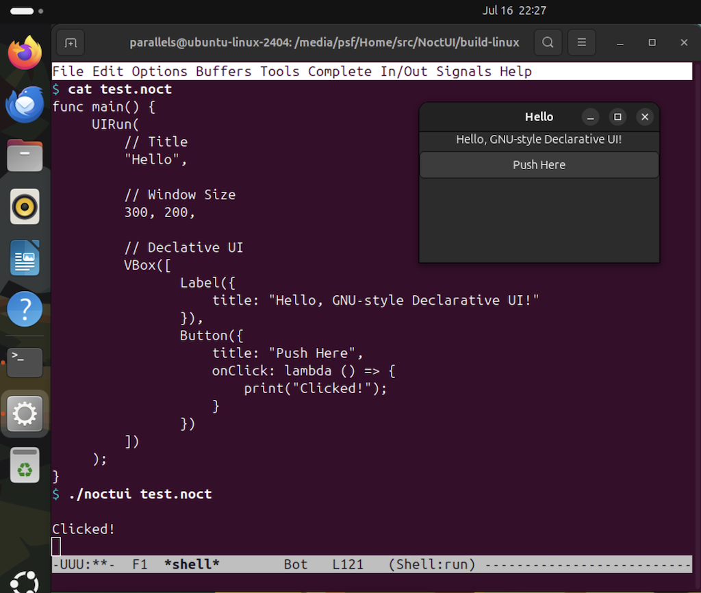

NoctUI
======

This is a demonstration of a GTK4 Declarative UI with Noct language.

```
func main() {
     UIRun(
         // Title
         "Hello",

         // Window Size
	 640, 480,

         // Declarative UI
         VBox([
		Label({
		    title: "Hello, GNU-style Declarative UI!"
		}),
		Button({
		    title: "Push Here",
		    onClick: lambda () => {
                        print("Clicked!");
		    }
		})
	 ])
     );
}
```


